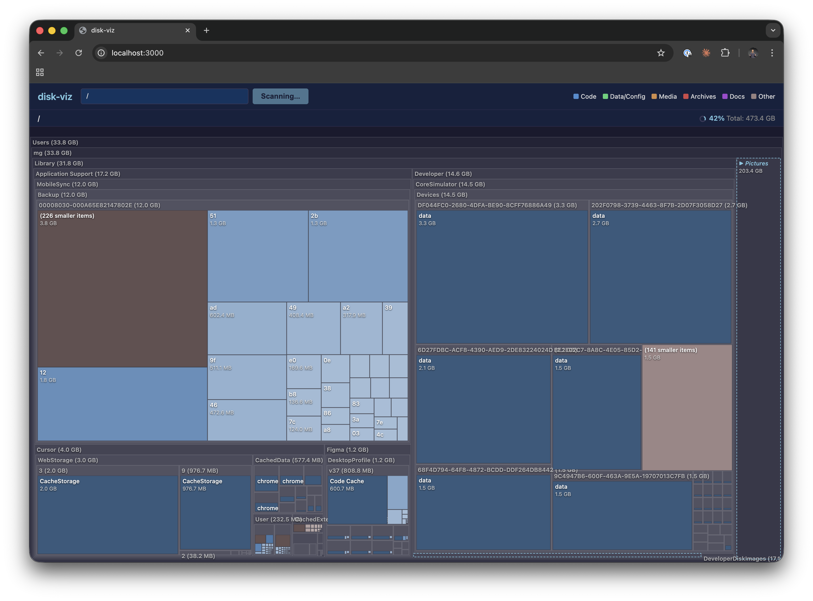

# disk-viz

An interactive, web-based disk space visualization tool. Scan any directory and explore its contents as a treemap, drill down into subdirectories, and delete files directly from the interface.



## Features

- **Streaming scan** — filesystem is indexed progressively with real-time progress updates via Server-Sent Events
- **Interactive treemap** — click to drill down into directories, right-click for options, Escape to go back up
- **Collapse/expand** — hide subdirectories to focus on what matters; state persists across sessions via localStorage
- **Delete files** — remove files and directories directly from the context menu
- **Breadcrumb navigation** — always know where you are and jump back to any parent

## Tech Stack

- **Runtime:** [Bun](https://bun.sh)
- **Backend:** TypeScript HTTP server with SSE streaming
- **Frontend:** React 19, D3-hierarchy (squarify treemap layout)

## Getting Started

```bash
bun install
bun --hot server.ts
```

Then open http://localhost:3000. Enter a directory path to scan (defaults to `/`).
